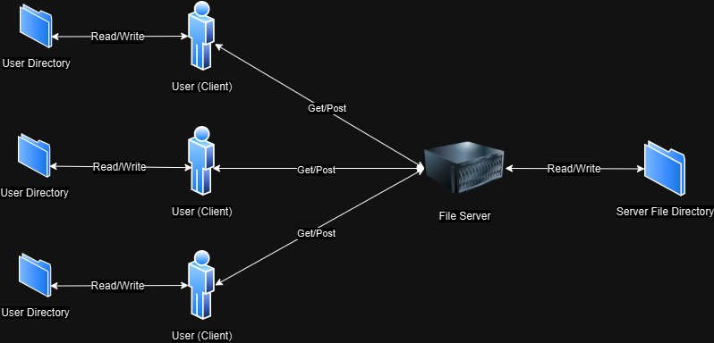

# Server-Client File Exchange 
> Server-client implementation of [RFC 6455 websocket protocol](https://www.rfc-editor.org/rfc/rfc6455) to file exchange 

A uint64_t flag, [max_clients](https://github.com/webbercyt/file_service/blob/master/utils/resource.h), controls the number of allowed workers/clients to server.



Please see details in [C4 diagrams](https://github.com/webbercyt/file_service/blob/master/diagrams.pdf).


## Development setup

1. Dependencies

   c++17

   boost 1.86.0 (minimum dependencies of boost are under ./third_party, idealy no more dependency setup required.)

3. Build

   cmake build file_server and file_client seperately


## Server usage example

* To start the server, run the command: file_server <host> <port> <threads> <file_root_root>

	example: 
	> file_server 0.0.0.0 80 4 /usr/files/server
	
	
	* To shut down the server, use the 'x' command
	>x


## Client usage example

* To start the client, run the command: file_client <host> <port> <file_root_root>

	example: 
	> file_client 192.168.0.1 80 /usr/files/client
	
	
	To shut down the client, use the 'x' command
	>x


* To retrive file(s) from server, use the 'get' command: get -{scope:a|s} {file_name} 
	
   {scope} = -a : get all files
   
   {scope} = -s : get singel file

	examples: 
	>get -a
	
	or
	>get -s server-client.png


* To send file(s) to server, run 'post' command: post -{scope:a|s} {file_name}

	
   {scope} = -a : get all files
   
   {scope} = -s : get singel file
   
	examples:
	>post -a
	
	or
	>post -s client-server.png


## Messages

JSON messages have been defined to indicate requests and responses

* Get file request message (from client to server)
   * uuid: unique message id, used to trace response
   * method: "get"
   * scope: "single" = single file; "all" = all valid files
   * target: file name, e.g. get_request_target.txt
 	```
	Examples
	
	{
		"uuid":"fd6b4eac-e386-4377-b4a5-0ec2cd182490"
		"method":"get"
		"scope":"all"
	}
	
	{
		"uuid":"fd6b4eac-e386-4377-b4a5-0ec2cd182490"
		"method":"get"
		"scope":"single"
		"target":"get_request_target.txt"
	}
	```


* Post file request message (from client to server, or verse)
   * uuid: unique message id, used to trace response
   * method: "get"
   * target: file name, e.g. get_request_target.txt
   * context: binary encoded context of file
	```
	Examples
	{
		"uuid":"fd6b4eac-e386-4377-b4a5-0ec2cd182490"
		"method":"post"
		"target":"post_request_target.txt"
		"context":"FFFFCAE051AE9"
	}
	```


* Response (from server to client)
   * uuid: unique message id, used to trace request
   * response: "accepted" or "rejected"
   * reason (optional): interpretation of response 
	```
	Examples
	{
		"uuid":"fd6b4eac-e386-4377-b4a5-0ec2cd182490"
		"response":"rejected"
		"reason":"failed to parse message"
	}
	```


## Todo 

* Handle errors in UTF-8 encoded data

Based on RFC 6455, when an endpoint is to interpret a byte stream as UTF-8 (e.g. file name) but finds that the byte stream is not, in fact, a valid UTF-8 stream, that endpoint fails the webSocket connection. What shall be further done is to handle non-UTF-8 stream properly. 
